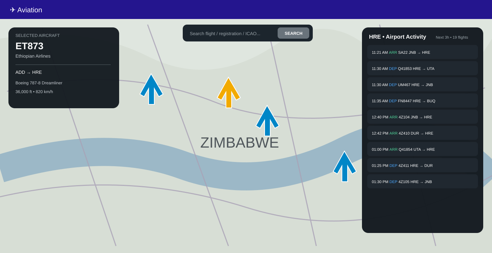

# ✈️ FlightRadar Card for Home Assistant

A FlightRadar-style dashboard card for Home Assistant, designed around a full-screen map, live aircraft movement, aircraft details and airport activity.



## Features

- 🗺️ Full-screen responsive map centred on a selected airport
- ✈️ Live flight data from the **Home Assistant FlightRadar24 integration**
- 🎯 Click aircraft without moving or resizing the map
- 🛰️ Smooth aircraft movement between Home Assistant updates
- 🛩️ High-quality aircraft SVG markers matched to aircraft category and size
- 🔎 Search by flight number, callsign, registration or ICAO24
- 📷 Aircraft photographs from the FlightRadar24 integration when available
- 📋 Expanded aircraft information including route, registration, ICAO24, altitude, speed and heading
- 🛬 Combined airport arrivals/departures board sorted chronologically by flight time
- 🛫 Configurable tracked airport
- ⏱️ Configurable airport activity timeframe
- 📏 Configurable live-aircraft radius
- 🔄 Configurable refresh interval
- 🔍 Configurable map zoom
- 📱 Responsive desktop, tablet and phone layout
- 🧩 Home Assistant graphical card configuration

## Data source

The card **does not require a separate FlightRadar24 API token**.

Instead, it reads the flight data already provided to Home Assistant by the HACS **Flightradar24 integration by AlexandrErohin**. That integration exposes detailed flight objects through the `flights` attribute of its sensors, including current position, altitude, speed, heading, aircraft information, route and aircraft photographs.

The card also uses the integration's **Airport arrivals** and **Airport departures** sensors for the airport board. The selected airport is explicitly written to the integration's airport-tracking text entity before the board is refreshed, so the board follows the airport selected on the card.

## Required Home Assistant integration

Install **Flightradar24** by AlexandrErohin through HACS before using this card.

1. Open **HACS → Integrations**.
2. Search for **Flightradar24**.
3. Install the integration by AlexandrErohin.
4. Restart Home Assistant.
5. Add/configure the Flightradar24 integration.
6. Set its monitoring location and radius to cover the area you want to display.

The card expects the integration to expose a **Current in area** sensor with a `flights` attribute. It also uses **Additional tracked**, **Airport arrivals** and **Airport departures** when available.

## Installation with HACS

1. Open **HACS** in Home Assistant.
2. Add `louisjferreira/ha-flightradar-card` as a custom repository if it is not already present.
3. Select **Integration** as the repository type.
4. Install **FlightRadar Card**.
5. Restart Home Assistant.
6. Add **FlightRadar Card** from the dashboard card picker.

The card's integration registers the frontend automatically. No separate FlightRadar24 API token is requested by this card.

## Adding the card

Add a new dashboard card and search for **FlightRadar Card**.

### Example YAML

```yaml
type: custom:flightradar-card
airport: HRE
radius_nm: 250
refresh_interval: 10
zoom: 7
activity_hours: 5
full_screen: true
```

The graphical configuration editor exposes the same options.

### Supported airports

The current built-in airport list includes:

`HRE`, `JNB`, `CPT`, `DUR`, `GBE`, `MPM`, `LUN`, `NBO`, `ADD`, `WDH`, `MUB`, `LHR`, `DXB`, `SIN`, `JFK`

The airport selector controls the map centre and the airport activity board. The map itself is **not restricted to flights arriving at or departing from that airport**; all live aircraft supplied by the FlightRadar24 integration inside its configured monitoring area are displayed.

## Search

The search box accepts:

- Flight number
- Callsign
- Aircraft registration
- ICAO24
- Aircraft code
- Airline

If a matching aircraft is not currently in the configured area, the card can use the FlightRadar24 integration's **Additional tracked** feature to request tracking of the flight.

## Aircraft details

Selecting an aircraft displays information such as:

- Flight number
- Callsign
- Airline
- Aircraft model/code
- Registration
- ICAO24
- Origin and destination
- Altitude
- Ground speed
- Vertical speed
- Track/heading
- Aircraft photograph when supplied by the integration

## Airport activity

The airport panel shows **one combined chronological board** for the selected airport. Arrivals and departures are mixed together and sorted by the relevant flight time.

The activity timeframe is configurable. For example, setting `activity_hours: 5` shows only flights scheduled in the next five hours, while a larger value can be used when a longer board is required.

Each row shows:

- Time
- **ARR** or **DEP**
- Flight number/callsign
- Origin → destination
- Aircraft type/code

The board is filtered to the selected airport only. For arrivals, the selected airport must be the destination; for departures, it must be the origin. The card also forces the upstream FlightRadar24 integration to track the selected airport before refreshing the airport feeds.

Rows in the activity board are clickable and select the corresponding aircraft when live flight data for that flight is available.

## Map behaviour

The selected airport centres the map and provides the geographic context for the live traffic returned by the Home Assistant FlightRadar24 integration.

Selecting an aircraft does not recenter, rebuild or resize the map. Aircraft markers are refreshed from the same FlightRadar24 data source and their movement is visually smoothed between updates.

Aircraft markers use dedicated SVG artwork for large jets, medium/large jets, single-prop aircraft and twin-prop aircraft. The marker is rotated to match the aircraft's current heading and the selected aircraft is highlighted separately.

The map uses OpenStreetMap tiles and does not require a separate map API token.

## Current limitations

- The card can only display aircraft that the Home Assistant FlightRadar24 integration provides.
- Coverage therefore depends on the monitoring area and data returned by that integration; the card cannot independently obtain the private FlightRadar24 consumer map feed without an FR24 API/service.
- Airport arrivals/departures require the upstream integration's airport tracking feature.
- Aircraft photographs are unavailable for some aircraft.
- The card does not attempt to reproduce every feature of the consumer FlightRadar24 website.

## Roadmap

- [x] FlightRadar24 integration data source
- [x] Live aircraft positions
- [x] Flight/registration search
- [x] Additional tracked search fallback
- [x] Selected aircraft tracking
- [x] Aircraft details
- [x] Aircraft photographs
- [x] Origin/destination data
- [x] Airport arrivals/departures data
- [x] Full-screen responsive map
- [x] Configurable airport
- [x] All-aircraft map traffic
- [x] Aircraft model-aware map icons
- [x] Chronological combined airport board
- [x] Configurable airport activity timeframe
- [x] Click-to-select from airport activity
- [x] Graphical card configuration
- [ ] Local ADS-B receiver provider
- [ ] Optional flight route line display
- [ ] Expanded airport database
- [ ] Optional iframe/FR24-style map provider

## Version

**1.0.3**

## License

MIT
